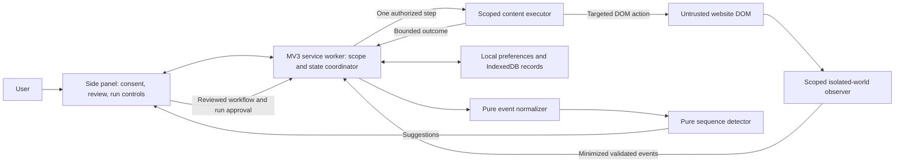
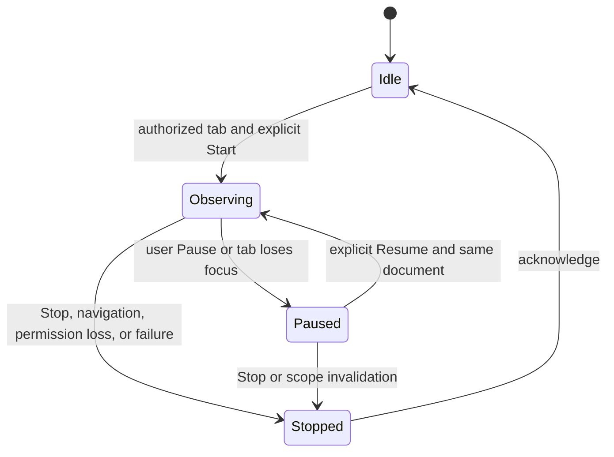
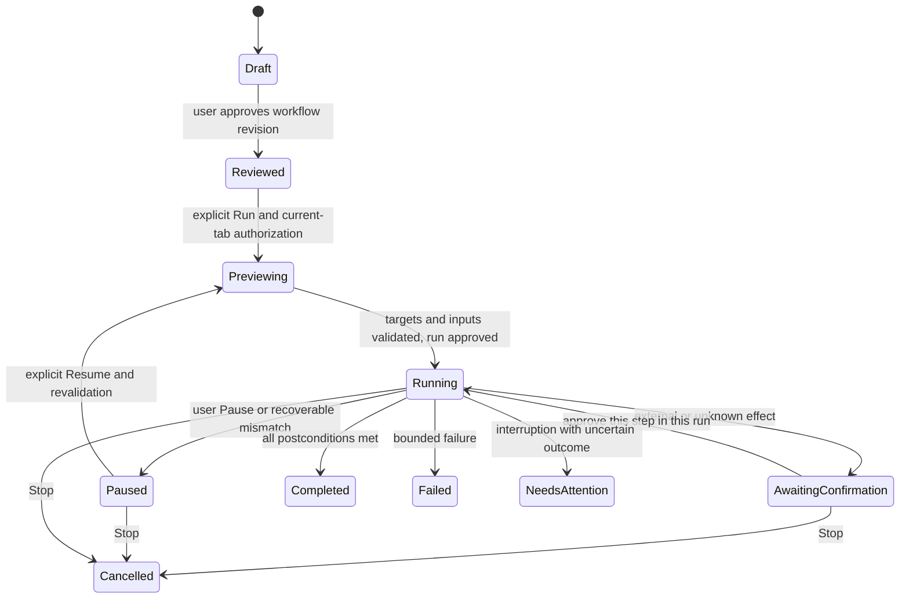

# RepeatFlow architecture

Status: architecture specification, updated 2026-09-23. The observation coordinator, observer, normalizer, detector, workflow validator, executor, repository, and side-panel controls across M1–M5 are fully implemented. See [readme.md](../readme.md) for current behavior and [roadmap.md](roadmap.md) for delivery gates.

## 1. Platform and current implementation

Target desktop Chrome 116+ with Manifest V3. Runtime code uses native ES modules and JavaScript/JSDoc; load unpacked directly from the repository root. Node 22+ runs development checks. Edge and Firefox compatibility are unverified.

The packaged side panel is the product's main surface. The module service worker registers a toolbar action handler that calls `sidePanel.open()` within the user gesture and restricts local/session storage to trusted extension contexts. These APIs are available within the chosen baseline. [Chrome Side Panel API](https://developer.chrome.com/docs/extensions/reference/api/sidePanel), [Chrome Storage API](https://developer.chrome.com/docs/extensions/reference/api/storage).

RepeatFlow packages the side panel, observer, executor, detector, workflow engine, coordinator, protocol validation, and repository. Runtime dependencies are native browser APIs only. The guide preference remains in `chrome.storage.local`; observation sessions/events, candidates, workflows, and run summaries are persisted atomically as a bounded versioned snapshot in IndexedDB. `chrome.storage.session` stores a browser-lifetime marker to distinguish ordinary worker suspension from browser/extension restart. Incognito is disabled; CSP prohibits packaged-page network connections.

## 2. Component boundaries

All components below are fully implemented and verified:

| Component | Responsibility | Boundary |
| --- | --- | --- |
| Side panel | Show session scope, suggestions, editable steps, inputs, preview, confirmations, Stop, and deletion | Never determines its own page permission or writes execution checkpoints directly |
| Coordinator | Validate messages; own session/run transitions; serialize writes; enforce permissions, retention, and confirmations | Never trusts a page's request to start or approve a run |
| Observer | Capture supported trusted interactions after consent; minimize before messaging | No raw input values, page text, arbitrary attributes, or stored selectors |
| Normalizer/detector | Convert bounded events into comparable symbols and exact repeated sequences | Pure modules with no Chrome API, DOM, storage, or network dependency |
| Workflow validator | Check versions, allowlisted steps, reviewed locators, variables, and approval revision | Declarative data only; no code generation or evaluation |
| Executor | Resolve the current target and perform one explicitly authorized step; check cancellation | Cannot choose a different tab/document, extend origin scope, or execute a whole unchecked queue |
| Repository adapter | Save small preferences in `chrome.storage.local`; use IndexedDB transactions for future events/workflows/runs | Worker owns writes; content scripts have no direct record access |

## 3. Permissions and scope

| Phase | Required permissions | Page access and purpose |
| --- | --- | --- |
| M0, implemented | `sidePanel`, `storage` | No website access; open the panel and save its guide preference |
| M1 implemented; retained through planned M5 | M0 plus `activeTab`, `scripting` | Temporary current-tab access for explicitly started observation or replay; programmatic injection into the top frame |
| After MVP, decision required | Optional per-origin host permissions if approved as a feature | Persistent observation only for individually enabled sites, with visible status and revocation controls |

No MVP `host_permissions`, static matching content scripts, `tabs`, `history`, `cookies`, `webRequest`, or `unlimitedStorage` permission is planned. The `tabs` namespace does not by itself require the `tabs` permission; avoid reading privileged tab fields without the current grant.

`activeTab` is granted when the user invokes an extension action, context-menu item, command, or omnibox suggestion. A Start button in an already-open side panel must not be assumed to grant it for a newly selected tab. M1 requires the user to click the toolbar action on the target tab, then explicitly choose Start observing; inspect the grant before injection and provide a clear reauthorization path. Same-origin navigation can retain the browser grant, while cross-origin navigation revokes it. Our product nevertheless ends the observation session on navigation/document replacement. [Chrome activeTab permission](https://developer.chrome.com/docs/extensions/develop/concepts/activeTab).

Each active operation binds to `(sessionId or runId, tabId, frameId=0, documentId, origin)`. The worker derives tab/frame/document identity from browser sender metadata and the injection result, not payload claims. MVP excludes iframes, cross-document workflows, closed shadow roots, browser-internal pages, extension stores, and file URLs. Injection failure is an unsupported-page result, never a reason to request broad permissions. A replacement document requires a fresh user-started session; an old content script cannot authorize its replacement.

## 4. Observation and repetition detection

M1 observes only ordinary button/link clicks and select/checkbox/radio interactions in one document. Free-entry text and number fields are excluded entirely, including unmarked sensitive fields. No field value is read or retained. Reject password, OTP, payment, secret-like, file, and unsupported editable controls before constructing an event. Ignore synthetic/replay events and high-volume signals such as mouse movement and raw keystrokes. Batch with strict limits and monotonically increasing sequence numbers; on overflow stop visibly instead of retaining unbounded data.

Identify targets with session-scoped opaque keys calculated from a sanitized structural tuple such as tag, role enum, supported field-kind enum, and bounded ancestry positions. A random session salt prevents cross-session linkage. No raw IDs, labels, classes, selectors, attribute values, or text are persisted. Such keys remain potentially sensitive metadata and are not described as anonymous. Structural changes can cause false negatives; this is an accepted first-version limitation.

M2 compares normalized symbols `(action, targetKey, fieldKind)` within one session. A candidate requires at least three non-overlapping occurrences of the same contiguous ordered sequence, with length 3–30. Occurrences may have unrelated events between them; each occurrence itself must be contiguous. Overlapping windows cannot inflate the count. Prefer longer candidates, then more occurrences, then earlier first occurrence; suppress a shorter candidate when all its occurrences are covered by an otherwise equivalent longer one. Use exact counts, not fabricated confidence percentages. Detection does not infer input values or prove that two tasks have equivalent business meaning.

Persisted events cannot reconstruct a replay locator. During M3 review, explicitly recapture and preview targets on the live page; if the source document is gone, ask the user to select them again. Only reviewed workflow locators may retain bounded, non-sensitive literal metadata. Contract details are in [data-model.md](data-model.md).

## 5. Lifecycle and state machines

Only active observation accepts new events. Changing tabs pauses collection until explicit Resume on the original document; buffered messages after the pause boundary are rejected. Extension/browser restart stops observation. Normal MV3 worker suspension may reconnect to the same still-authorized observer after validating persisted session state, active tab, origin, and document. Persisted metadata alone never authorizes a new observer. The observer keeps a bounded in-memory queue; a failed or rejected batch pauses capture and requires explicit Resume. Normal worker suspension is transparent to successful runtime messaging, and the coordinator revalidates session, sender, epoch, active tab, and origin before accepting a batch. Reject batches for paused/stopped sessions or invalid scope. Lost observer context ends the session and requires a new explicit Start.

Stop is also available during preview and recovery. Workflow edits invalidate review. Run approval names a workflow revision, tab, document, and inputs; confirmation for an external effect additionally names one step and expires on scope/target changes. No scheduled, unattended, or concurrent runs exist in MVP.

MV3 workers can be terminated and lose global variables; timers and open messaging channels are not durable execution state. Register listeners synchronously and recover from storage on each start. Use callback-style asynchronous message replies with literal `return true` for the Chrome 116 baseline, without relying on newer Promise-returning listener behavior. [Worker lifecycle](https://developer.chrome.com/docs/extensions/develop/concepts/service-workers/lifecycle), [Chrome messaging](https://developer.chrome.com/docs/extensions/develop/concepts/messaging).

Persist a step intent before dispatch and its acknowledged outcome afterward. A run interrupted between these writes is `needsAttention`, not automatically resumed. Serialization plus transaction revisions prevent two panels or stale messages from executing the same next step. Run-only input values stay in panel memory, disappear on panel closure, and must be re-entered after interruption; checkpoints contain no values. No exactly-once guarantee is possible for arbitrary website effects.

## 6. Locators, replay, and failures

Reviewed locators prefer a stable non-sensitive test attribute, then a role plus reviewed name, then a reviewed ID or scoped selector. Store a bounded ordered list, not arbitrary executable expressions. A fallback is eligible only when earlier locators return zero results; any ambiguity or conflict between matches stops resolution. Require one visible, enabled match in the authorized document and preview its identity. Coordinates and “first match” are not acceptable fallbacks.

Allowlisted steps are click, fill a non-secret parameter, choose an option, set a checkbox, and wait for a reviewed condition. No navigation step is in MVP. DOM-generated input may be rejected by some sites; unsupported controls require manual interaction. Immediately before any action, recheck scope, target, cancellation, and approval. Unknown clicks default to confirmation. Submitting, deleting, sending, publishing, and purchasing always require confirmation, irrespective of labels or user reclassification. Filling a field can itself trigger a website update; treat unknown/auto-save controls as external effects too.

| Failure | Required result |
| --- | --- |
| Target missing, hidden, changed, or ambiguous | Pause with a bounded error; require target review before retry |
| Navigation, closed tab, lost grant, stale document | Stop observation or cancel/pause run; never follow silently |
| Wait timeout | Report failed condition; do not skip into the next action |
| Worker crash or missing acknowledgement after action dispatch | `needsAttention`; user inspects actual website state before a fresh decision |
| Storage quota/write failure | Stop before more collection/actions; preserve existing records and show remediation |
| User Stop | Cancel pending work and check cancellation before next action; disclose completed effects |
| Malformed or unauthorized message | Reject without state mutation or page action; record only a bounded error code |

Retries may resolve targets or read conditions with a bounded deadline; they never repeat an action with a possibly completed external effect. Stop cannot undo actions the website already accepted.

## 7. Data and trust boundaries

Treat DOM content and content-script messages as untrusted. Validate the sender extension ID, expected extension-page URL for panel commands, browser tab/frame/document/origin for observer/executor messages, protocol version, message type, payload shape and size, session state, and sequence number. Never expose generic “execute script”, arbitrary URL fetch, or storage-write handlers. Render strings as text. [Chrome extension security guidance](https://developer.chrome.com/docs/extensions/develop/security-privacy/stay-secure).

Keep `chrome.storage.local` restricted with `setAccessLevel({ accessLevel: "TRUSTED_CONTEXTS" })`; content scripts submit minimized messages to the coordinator. Store no secrets. No `storage.sync` or network export is used. Local browser data remains accessible to the profile owner and is not a secret vault. [Chrome Storage API](https://developer.chrome.com/docs/extensions/reference/api/storage).

M1 retention is seven days or 10,000 total events and at most 250 session summaries, including empty stopped summaries. Future run retention is 30 days or 1,000 run summaries; workflows until deletion. Prune on writes, startup, and before reads/export so suspension cannot expose expired data. Evict dependent candidate evidence with events. Deletion must cancel affected sessions/runs before removing their records. Exports require preview and deliberate user action and exclude run inputs and observed values by design. See [rule.md](rule.md) and [testing.md](testing.md) for implementation and verification obligations.
